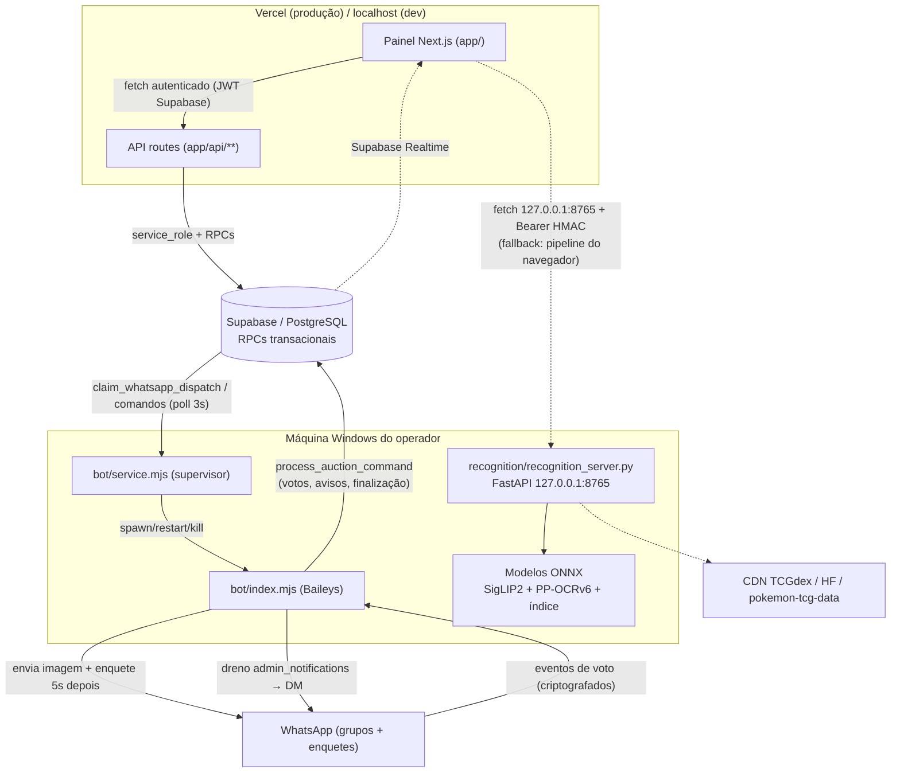

# 02_ARCHITECTURE — Arquitetura real do sistema

> Área: Arquitetura
> Escopo: Componentes, pontos de entrada, comunicação, diagramas
> Última atualização: 2026-09-23
> Fonte principal: `scripts/start-all.mjs`, `bot/service.mjs`, `bot/index.mjs`, `recognition/recognition_server.py`, `app/api/**`, `lib/supabase-server.ts`

## Diagrama real (confirmado no código)

## Componentes e pontos de entrada

### 1. Painel (Next.js 16 App Router)
- Entrada: `npm run dev` / `next start` (produção local) / deploy Vercel.
- Páginas: `app/page.tsx` (login), `app/dashboard.tsx`, `app/auctions/new/page.tsx` (wizard em lote, `bulk-wizard.tsx`), `app/auctions/new/single/page.tsx` (wizard único, `wizard.tsx`), `app/whatsapp/page.tsx` (central WhatsApp).
- Auth: Supabase Auth (JWT) + `authorize()` em `lib/backend.ts` valida `admin_profiles` (role admin/operator, active).

### 2. API (app/api/**)
- 18 routes (mapa completo em `04_API.md`). Todas Node runtime, `authorize(request, write?)` no início; nenhuma lógica transacional fora do banco.
- Server-only: `lib/supabase-server.ts` (service_role) — nunca vai ao cliente.

### 3. Supabase
- Schema vivo em `supabase/schema.sql` + `supabase/operations.sql` + `supabase/whatsapp_bridge.sql` + `supabase/migrations/*.sql` (aplicação manual via SQL Editor; CI aplica todas em ordem em Postgres real).
- Contrato central: `process_auction_command(p_command jsonb, p_admin_user_id uuid)` — TODOS os eventos de negócio (BID_*, BUYOUT_*, AUCTION_*, CARD_*, PARTICIPANT_*, AUCTION_FINALIZE) são idempotentes por `eventId`.

### 4. Bot (bot/)
- **Supervisor** `bot/service.mjs`: heartbeat (10-15s) em `whatsapp_bot_workers`, poll de comandos `whatsapp_bot_commands` (3s), spawn/restart do filho, restart noturno (`BOT_NIGHT_RESTART_HOUR`), limpeza 30d (`cleanup_old_auctions`), QR/session state para o painel.
- **Filho** `bot/index.mjs`: Baileys; loop de scheduler 3s (publica dispatches vencidos, finaliza leilões, drena `admin_notifications`); decriptografia de votos; `connectionReplaced`/reconexão com backoff; caches limitados (LRU).
- **Trava de sessão** `bot/session-guard.mjs`: porta TCP derivada de hash do caminho da sessão — impede 2 bots na mesma sessão.
- **Worker de fila** `bot/queue-worker.mjs`: claim com lock + heartbeat de lock, retries com backoff (máx. ~23min), idempotência por dispatch event-id.

### 5. Reconhecimento (recognition/)
- Serviço FastAPI `recognition/recognition_server.py` (127.0.0.1:8765): `/health`, `/recognize`, `/scan/{lang}/{id}`, `/catalog/exists`, `/memory/*`, `/reload-index`.
- Pipeline: `recognizer/pipeline.py` (rotas A/B + fusão), `recognizer/ocr.py` (PP-OCRv6 por regiões), `recognizer/embed.py` (SigLIP2 ONNX), `recognizer/features.py` (SIFT+RANSAC), `recognizer/catalog.py`/`store.py` (catálogo TCGdex), `recognizer/service_auth.py` (HMAC).
- Carga lazy + descarga por inatividade (`RECOGNITION_IDLE_UNLOAD_MINUTES`); `/health` frio arma warm em background.

### 6. Scripts (scripts/)
- `start-all.mjs` — orquestrador Windows: `next start` + `bot/service.mjs` + `recognition_server.py`; restart supervisionado limitado (2/10min) para o serviço de reconhecimento.
- `recognition-shared.mjs` — launcher `recognition:install|local|index` (build de índice **força CPU** no Windows).
- `build-card-visual-index*.mjs` — utilitários de índice.

### 7. CI (.github/workflows)
- `ci.yml`: Postgres 17 real → bootstrap + schema + bridge + TODAS migrations em ordem → SQL tests → `tests/concurrency.py` → typecheck → testes node → bot check → build → smoke (`tests/smoke.mjs`); job Python (compileall + unittest); job Windows (start-all test + validação PS1).
- `card-recognition-*.yml`: tools de índice (ver arquivo para detalhes — precisa de investigação para uso rotineiro).

## Comunicação entre componentes — contratos-chave

| Contrato | Onde | Invariante |
|---|---|---|
| Comando de negócio idempotente | `process_auction_command` | mesmo `eventId` + mesmo payload → resultado em cache (`processed_commands`); payload diferente → `event_id_conflict` |
| Voto de enquete → lance | `bot/index.mjs::handlePollVote` | eventId `wa-vote:{poll}:{participant}:{ts}:{amount}`; guardas `stale_event`/`deadline_expired`/`bid_increment_required` |
| Health do reconhecimento | `/health` | `ready=true` só com catálogo + índice + modelos carregados + secret configurado; o wizard só usa o serviço com `ready===true` |
| Token de reconhecimento | `/api/card-recognition/token` + `recognizer/service_auth.py` | HMAC-SHA256, TTL ≤15min, aud `pokemon-card-recognition`, mesmo segredo nos dois lados |
| Claim de dispatch | `claim_whatsapp_dispatch` | fila pausada/completa não é claimada; lock com heartbeat evita re-claim prematuro |

## Decisões importantes

- Painel nunca fala com o WhatsApp; só o bot (local) envia mensagens.
- Publicação de lote: **imagem primeiro, enquete 5s depois** (delay implementado no fluxo de publicação do bot).
- Reconhecimento por trás de autenticação própria (commit `eea1fdc8` em diante) — sem o segredo configurado o serviço reporta `ready=false` e o site cai no pipeline do navegador.
- Descarga de modelos por inatividade + warm em background no `/health` (não carrega no boot; `--preload` removido dos launchers).

## Riscos estruturais

- Baileys é API não oficial: risco de ban e quebras de protocolo em upgrades (pinned em 7.0.0-rc14 + `bot/patch-baileys.mjs`).
- Migrations aplicadas manualmente: risco de drift entre repo e instância (mitigado pelo CI que aplica todas em ordem; a instância de produção depende do operador aplicar).
- DirectML instável na RX 570 para builds longos (NaN) — mitigado com CPU forçada no build + demotion automático em runtime.
