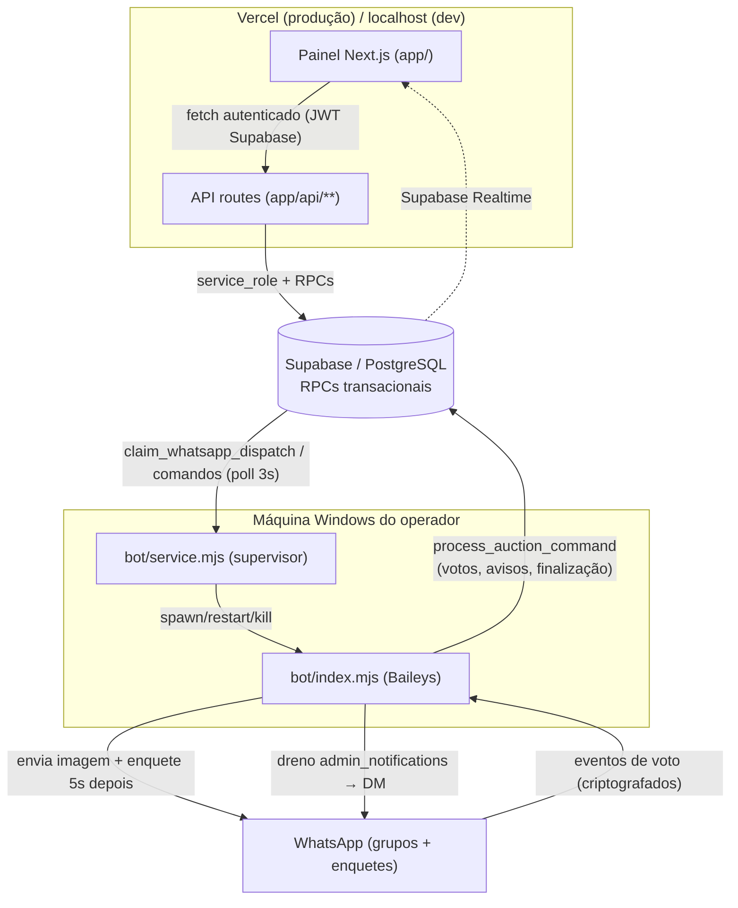

# 02_ARCHITECTURE — Arquitetura real do sistema

> Área: Arquitetura
> Escopo: Componentes, pontos de entrada, comunicação, diagramas
$12026-10-05
> Fonte principal: `scripts/start-all.mjs`, `bot/service.mjs`, `bot/index.mjs`, `app/api/**`, `lib/supabase-server.ts`

## Diagrama real (confirmado no código)

```mermaid
flowchart TD
    subgraph Vercel["Vercel (produção) / localhost (dev)"]
        UI["Painel Next.js (app/)"]
        API["API routes (app/api/**)"]
    end
    DB[("Supabase / PostgreSQL\nRPCs transacionais")]
    subgraph PC["Máquina Windows do operador"]
        SUP["bot/service.mjs (supervisor)"]
        CHILD["bot/index.mjs (Baileys)"]
    end
    WA["WhatsApp (grupos + enquetes)"]

    UI -->|"fetch autenticado (JWT Supabase)"| API
    API -->|"service_role + RPCs"| DB
    DB -->|"claim_whatsapp_dispatch / comandos (poll 3s)"| SUP
    SUP -->|"spawn/restart/kill"| CHILD
    CHILD -->|"envia imagem + enquete 5s depois"| WA
    WA -->|"eventos de voto (criptografados)"| CHILD
    CHILD -->|"process_auction_command\n(votos, avisos, finalização)"| DB
    CHILD -->|"dreno admin_notifications → DM"| WA
    DB -.->|"Supabase Realtime"| UI
```

## Componentes e pontos de entrada

### 1. Painel (Next.js 16 App Router)
- Entrada: `npm run dev` / `next start` (produção local) / deploy Vercel.
- Páginas: `app/page.tsx` (login), `app/dashboard.tsx`, `app/auctions/new/page.tsx` (wizard em lote, `bulk-wizard.tsx`), `app/auctions/new/single/page.tsx` (wizard único, `wizard.tsx`), `app/whatsapp/page.tsx` (central WhatsApp).
- Auth: Supabase Auth (JWT) + `authorize()` em `lib/backend.ts` valida `admin_profiles` (role admin/operator, active).

### 2. API (app/api/**)
- 20 routes (mapa completo em `04_API.md`). Todas Node runtime, `authorize(request, write?)` no início; nenhuma lógica transacional fora do banco.
- Server-only: `lib/supabase-server.ts` (service_role) — nunca vai ao cliente.

### 3. Supabase
- Schema vivo em `supabase/schema.sql` + `supabase/operations.sql` + `supabase/whatsapp_bridge.sql` + `supabase/migrations/*.sql` (aplicação manual via SQL Editor; CI aplica todas em ordem em Postgres real).
- Contrato central: `process_auction_command(p_command jsonb, p_admin_user_id uuid)` — TODOS os eventos de negócio (BID_*, BUYOUT_*, AUCTION_*, CARD_*, PARTICIPANT_*, AUCTION_FINALIZE) são idempotentes por `eventId`.

### 4. Bot (bot/)
- **Supervisor** `bot/service.mjs`: heartbeat (10-15s) em `whatsapp_bot_workers`, poll de comandos `whatsapp_bot_commands` (3s), spawn/restart do filho, restart noturno (`BOT_NIGHT_RESTART_HOUR`), limpeza 12h (`cleanup_old_auctions`), QR/session state para o painel.
- **Filho** `bot/index.mjs`: Baileys; loop de scheduler 3s (publica dispatches vencidos, finaliza leilões, drena `admin_notifications`); decriptografia de votos; `connectionReplaced`/reconexão com backoff; caches limitados (LRU).
- **Trava de sessão** `bot/session-guard.mjs`: porta TCP derivada de hash do caminho da sessão — impede 2 bots na mesma sessão.
- **Worker de fila** `bot/queue-worker.mjs`: claim com lock + heartbeat de lock, retries com backoff (máx. ~23min), idempotência por dispatch event-id.

### 5. Scripts (scripts/)
- `start-all.mjs` — orquestrador Windows: `next start` + `bot/service.mjs` (site e bot são essenciais: qualquer um saindo derruba o conjunto; tree-kill no Windows para não deixar órfãos).
- `doctor.mjs` — check-up pré-leilão (migrations, RPCs, heartbeat do bot, figurinha, backup) com verificações de tabela em paralelo.

### 6. CI (.github/workflows)
- `ci.yml`: Postgres 17 real → bootstrap + schema + bridge + TODAS migrations em ordem → SQL tests → `tests/concurrency.py` → typecheck → testes node → bot check → build → smoke (`tests/smoke.mjs`); job Windows (start-all test + validação PS1 do serviço do bot).

## Comunicação entre componentes — contratos-chave

| Contrato | Onde | Invariante |
|---|---|---|
| Comando de negócio idempotente | `process_auction_command` | mesmo `eventId` + mesmo payload → resultado em cache (`processed_commands`); payload diferente → `event_id_conflict` |
| Voto de enquete → lance | `bot/index.mjs::handlePollVote` | eventId `wa-vote:{poll}:{participant}:{ts}:{amount}`; guardas `stale_event`/`deadline_expired`/`bid_increment_required` |
| Claim de dispatch | `claim_whatsapp_dispatch` | fila pausada/completa não é claimada; lock com heartbeat evita re-claim prematuro |

## Decisões importantes

- Painel nunca fala com o WhatsApp; só o bot (local) envia mensagens.
- Publicação de lote: **imagem primeiro, enquete 5s depois** (delay implementado no fluxo de publicação do bot).
- Reconhecimento automático de cartas REMOVIDO por completo (2026-10-05): o wizard é 100% manual; nenhuma dependência de IA/Python/índice.

## Riscos estruturais

- Baileys é API não oficial: risco de ban e quebras de protocolo em upgrades (pinned em 7.0.0-rc14 + `bot/patch-baileys.mjs`).
- Migrations aplicadas manualmente: risco de drift entre repo e instância (mitigado pelo CI que aplica todas em ordem; a instância de produção depende do operador aplicar).
